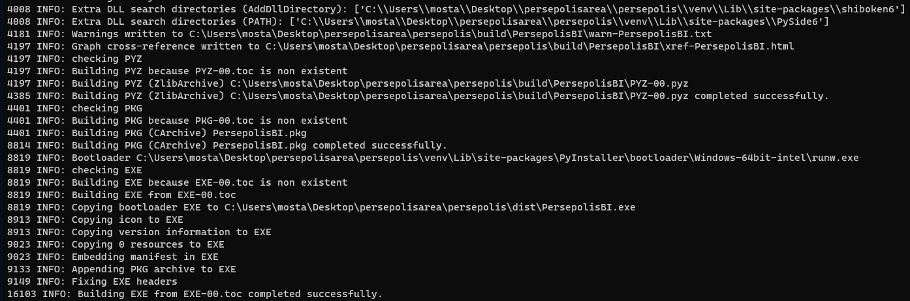

# persepolis windows package build
windows package build for [Persepolis Download Manager](https://github.com/persepolisdm/persepolis)

Persepolis team build stable releases safely and you don't need this if you just want use Persepolis Download Manager you can download stable windows version from [release page](https://github.com/persepolisdm/persepolis/releases), this is a instruction for build persepolis from source for windows.
# step 1: Preparing
- ## 1-1 clone or download [Persepolis](https://github.com/persepolisdm/persepolis)

you can download usually or using git clients, I recommend [git for windows](https://git-scm.com/download/win)

you can download the stable version Source code from [release page](https://github.com/persepolisdm/persepolis/releases) or last beta version from the [master branch](https://github.com/persepolisdm/persepolis/archive/master.zip) after downloading or cloning extract and enter persepolis path, you now should see such this structure
```
persepolis
├── man
├── persepolis
│   ├── gui
│   └── scripts
├── resources
│   ├── Archdroid-Blue
│   ├── Archdroid-Red
│   ├── Breeze
│   ├── Breeze-Dark
│   ├── locales
│   ├── Papirus
│   ├── Papirus-Dark
│   └── Papirus-Light
├── test
└── xdg
```

we also need some file that I put them in this repository and we use them to build, so clone or download [this repository](https://github.com/mostafaasadi/persepolis-windows-package-build)

- ## 1-2 python
persepolis has been written in python so we need python3 to build it, after freezing and building the package there are no more need python and its library
so download latest [python3](https://www.python.org/downloads/windows/) and install it.

**remember** the **destination directory** and enable the **“Add Python 3.6 to PATH” option.**

- ## 1-3 dependencies & libraries
install these libraries with `pip` from windows **cmd** or **powershell** (*you should run pip as Admin*)

`pip install pyqt5 requests pypiwin32 setproctitle psutil youtube_dl pyinstaller`

persepolis is gui for [**Aria2**](https://aria2.github.io) so we need it, you can download latest or specific version according to your system from [Aria2 release page](https://github.com/aria2/aria2/releases/) or use one of Aria2 build I put in this repository at aria2 folder (*we will need it ahead*)

- ## 1-4 windows SDK
download and install the [Windows Software Development Kit (SDK)](https://developer.microsoft.com/en-us/windows/downloads/windows-10-sdk) for Windows 10, we need it for Application Certification Kit API.

# step 2: test and run
place **aria2c.exe** in test folder next to the test.py according to your system architecture

with windows cmd or powershell or [git bash](https://git-scm.com/download/win) enter (`cd`) that cloned persepolis directory and run persepolis as test with this command

`python test/test.py`

- now persepolis should works completely and perfectly as test and a python script. if you get some trouble or error you may had mistake on these steps or open issue.

# step 3: build and freeze
now let's build persepolis!

place `version.py` and `persepolis.ico` in perseplois folder.

run Windows cmd or powershell (as Admin) and enter persepolis folder so build persepolis by pyinstaller with this command:

```
pyinstaller '.\persepolis\Persepolis Download Manager.py'  -p "C:\Program Files (x86)\Windows Kits\10
\Redist\ucrt\DLLs\x64" -p C:\python35\Lib\site-packages\PyQt5\Qt\bin\ -w -F -i persepolis.ico -n "Persepolis Download Manager
" --version-file version.py
```

if you changed **windows SDK** (step 1-4) and **python** (step 1-2) installation directory you should change `-p(path)`

`-w` means it is a windowed app, not a console one.

`-F` Create a one-file bundled executable.

`-i` perseplois icon.

`-n` name of bundled executable.

`--version-file` add persepolis version resource from `version.py` to the exe.

if everything goes ok, you have some output like this



if you get some trouble or error you may had mistake on these steps or open issue.

- after this, you have bundled executable file in dist folder, place `aria2c.exe` next to the `Persepolis Download Manager.exe`. you can run it and test it, it should works perfectly, also you can use it as portable persepolis.

# step 4: create package installer
you have executable perseplois and you can put it everywhere (next to the `aria2c.exe`) but we going to create a installer for windows

- download and install [Inno Setup](http://www.jrsoftware.org/isdl.php)
- you can create your installation or use our standard one, I put theme in this repository for both 32 and 64 architecture (`.iss files`). you should edit *`[Files]`* section and *LicenseFile, InfoAfterFile, OutputBaseFilename, SetupIconFile, UninstallDisplayIcon* according to your directory name, also I put license, persepolis readme, after installation text and icon in this repository.
- build and compile installation if everything goes ok, you have a persepolis installer.

 join it. :blush:
