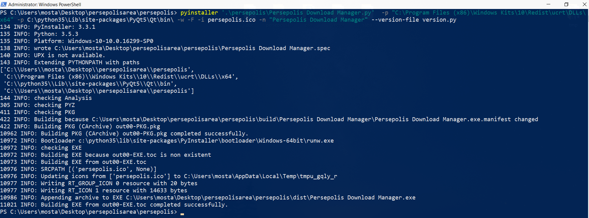

# Persepolis Microsoft Windows package build

If you just want to use persepolis as a download manager you don't need to build it yourself.  
**We build and provide Windows installers from the latest stable version of persepolis for both 32 and 64 bits versions which are available in [release page](https://github.com/persepolisdm/persepolis/releases).**

But If you are interested to:

- install persepolis as an script
- modify persepolis source code and see results of your changes easily
- build a executable or installer for Windows from your customized version of Persepolis

then this instruction could help you.

Some notes before we begins:
- You must have admin privilege to install and run softwares.
- `powershell` and `cmd` are the same for this instruction. From now we just call them both a `terminal`. We recommend to use `powershell`.
- We suppose you know how to use one of these terminals to do simple operations such as copy, change directory and run python scripts.
- Commands in following sections are for 64 bits version of Windows. But the instruction could be applied for 32 bits version too with some modification. 
- It is easier to follow this instruction if you have a copy (or clone) of this repository and persepolis. You can download latest versions in zip format from these urls:
    - [this repository](https://github.com/persepolisdm/persepolis-windows-package-build/archive/master.zip)
    - [persepolis](https://github.com/persepolisdm/persepolis/archive/master.zip)
- If you do not want to contribute to this repository or persepolis itself then `git` is not necessary. But we recommend using git to clone. If you clone these two projects with git you will access to previous versions and other branches too. Also every time a change is committed to persepolis or this repository, you don't need to get a new whole copy of these two. You just need to pull changes to your clones. It saves time and internet traffic.


<hr/>

# Run persepolis from script

## Clone this repository and persepolis

We are going to clone this repository to a folder named `pdm-windows` and clone persepolis inside this folder.  
Open a terminal and change directory to your workspace. Then:

```powershell
git clone https://github.com/persepolisdm/persepolis-windows-package-build.git pdm-windows
pushd pdm-windows
git clone https://github.com/persepolisdm/persepolis
```

Now you must have this folder structure:

```
pdm-windows
├── img
├── resources
|   ├── aria2
|   ├── ffmpeg
|   └──...
├── persepolis
|   ├── ...
|   ├── persepolis
|   ├── ...
|   ├── test
|   └──...
└──...
```

## Get or install dependencies

Before we can run Persepolis we need to get some binaries.  
Persepolis is written in `python 3` and needs `aria2` and `ffmpeg` to run.  
If you cloned this repository, there are `aria2` and `ffmpeg` binaries in `resource` folder for 32 and 64 bit architecture. These binaries might not be the latest versions but they work fine. If you are interested to use the latest version, you can get it from [aria2 official website](https://aria2.github.io) and [ffmpeg official website](https://www.ffmpeg.org/).  

Get the latest Windows `python 3` installer for your architecture from [official python website](https://www.python.org/downloads/) and run the executable. We recommend change default installation directory to a shorter path like `C:\python3` and enable `Add Python 3.x to PATH`. To verify successful installation, open a windows terminal and run these commands:

```shell
python --version
pip --version
```

If there is no problem, you are ready to run persepolis as a scripts. Persepolis uses third party libraries that can be installed by python package manager `pip`.  

If you cloned this repository, you can open a windows terminal here and run this command to install these libraries:

```powershell
pip install -r requirements.txt
```

Otherwise use this command:

```shell
pip install PyQt5 PyQt3D requests pypiwin32 psutil youtube_dl
```

## Run persepolis

To test if persepolis runs with no problem, open a terminal in here (`pdm-windows` folder) and copy appropriate `aria2c.exe` and `ffmpeg.exe` to `test` folder in persepolis clone. Then run test script provided by persepolis package. Use following commands:

```powershell
copy .\resources\aria2\64\aria2c.exe .\persepolis\test\
copy .\resources\ffmpeg\64\ffmpeg.exe .\persepolis\test\
pushd .\persepolis\test
python .\test.py
```

If there is no problem then you can move on to next section.

<hr/>

# Build an executable from persepolis

##  Install development dependencies:

We use `pyinstaller` to create an executable from persepolis source code. It is a third party python package and can be installed with `pip`:

```powershell
pip install pyinstaller
```

Also we need Windows Software Development Kit for Application Certification Kit API.  
For example you can download the latest Windows 10 SDK [from this instruction](https://developer.microsoft.com/en-us/windows/downloads/windows-10-sdk).  
Also a list of previous versions of Windows SDK is available [here](https://developer.microsoft.com/en-us/windows/downloads/sdk-archive)

## Build

Open a terminal as administrator in here (`pdm-windows`) and run this command:
```powershell
pyinstaller ".\persepolis\persepolis\Persepolis Download Manager.py"  -p "C:\Program Files (x86)\Windows Kits\10\Redist\ucrt\DLLs\x64" -p "C:\python3\Lib\site-packages\PyQt5\Qt\bin\" -i ".\resources\persepolis.ico" --version-file ".\resources\version.py" -w -F -n "Persepolis Download Manager"
```

Just for your information:
- `-w` means it is a windowed app, not a console one.
- `-F` creates a one-file bundled executable.
- `-i` is pointing to persepolis icon.
- `-n` name of bundled executable.
- `--version-file` adds persepolis version resource from `resources/version.py` to the exe.

If you changed python and windows sdk installation path, you must change paths in command above to point to correct paths.

If everything goes well, you have some output like this:



After this, you have bundled executable file in a pyinstaller created `dist` folder.  
Move appropriate `ffmpeg.exe` and `aria2c.exe` next to the `Persepolis Download Manager.exe` in `dist` folder. You can run it and test if it is working.

You can use this `dist` folder containing these 3 binaries as your final Persepolis Download Manager application. But if you want to be able install it permanently follow next section.

<hr/>

# Create Package installer for Persepolis Download Manager

We use [Inno Setup](http://www.jrsoftware.org/isdl.php) to make an installer. Download and install Inno.

You can create your installer instruction script from scratch.  
Or use our scripts provided in this repository (`.iss files`).  
Open one of `.iss` file compatible with your architecture by Inno Setup. Then use compile button.  
If everything goes well, you have a persepolis installer created in `Installer` directory.

 Enjoy it. :blush:

<hr/>

 # TODO:
 - Instruction about editable installation
 - Provide script to automate some steps
 